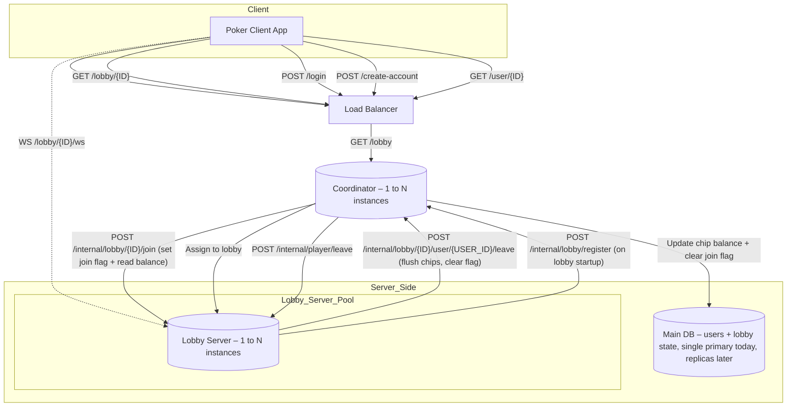

# Online Poker Platform – Scalable Architecture Design

## Overview

This document outlines the system architecture and design decisions for building a scalable online poker platform. While the current implementation is minimal and suited for a single developer, the design anticipates scaling to 100,000 daily users.

## High-Level Goals

* Support 100k daily users (\~5k concurrent)
* Scalable and modular services
* Strong consistency for chip balances and session state
* Designed for AWS deployment with Terraform (future phase)
* Single instance DB and Coordinator now, horizontally scalable later

---

## Core Components

### Poker Client App

* Connects via WebSocket to lobby servers
* Initiates REST calls for login, user info

### Load Balancer

* Routes REST requests to one of several Coordinators
* Could be AWS ALB, scalable with autoscaling rules

### Coordinator

* Stateless REST server handling:

  * Lobby listings
  * User login and account creation
  * Leave events: updates chip balance and clears `in_lobby` flag
  * Notifies lobby of player leave through internal-only API
* Talks directly to the Main DB

### Lobby Server

* Manages gameplay and WebSocket communication
* On join: receives chip balance from Coordinator via internal HTTP API
* During game: maintains chip state in memory
* On player leave/disconnect: calls internal Coordinator API to flush chip delta and clear flags
* Exposes an internal HTTP API for coordinators to notify player disconnection
* **No direct DB access**

### Main DB

* Single instance today, future-ready for replication
* Tracks:

  * User profiles
  * Chip balances
  * `in_lobby` flag to prevent simultaneous lobby entries
  * **Lobby metadata**: lobby ID, max players, current players, status

---

## Database Schema (MVP)

### `users`

| Column          | Type            | Notes                          |
| --------------- | --------------- | ------------------------------ |
| `id`            | UUID (PK)       | Primary key                    |
| `username`      | VARCHAR UNIQUE  | Display / login name           |
| `password_hash` | VARCHAR         | Argon2 / bcrypt hash           |
| `chip_count`    | BIGINT UNSIGNED | Current chip balance           |
| `in_lobby`      | BOOLEAN         | `TRUE` while seated in a lobby |

### `lobbies`

| Column        | Type      | Notes                                              |
| ------------- | --------- | -------------------------------------------------- |
| `id`          | UUID (PK) | Set by Coordinator `POST /internal/lobby/register` |
| `target`      | VARCHAR   | Host/IP + port or other connection identifier      |
| `max_players` | SMALLINT  | Table capacity                                     |

### `lobby_players`

Associates players currently seated in a lobby.

| Column     | Type      | Notes                   |
| ---------- | --------- | ----------------------- |
| `lobby_id` | UUID (FK) | References `lobbies.id` |
| `user_id`  | UUID (FK) | References `users.id`   |

---

## Key Coordinator Endpoints

### User Management

* `POST /login`
* `POST /create-account`
* `GET /user/{id}`

### Lobby Management

* `GET /lobby` – List all available lobbies
* `GET /lobby/{id}` – Get specific lobby info

### \[Internal] Lobby Coordination API

* `POST /internal/lobby/register` – Lobby server registers itself with Coordinator
* `POST /internal/lobby/{id}/join` – Join a user to the lobby, return chip balance, set in\_lobby flag
* `POST /internal/lobby/{id}/user/{id}/leave` – Handles user disconnected or left

  * Only callable from Lobby, placed on an internal network (not client-facing)
  * Future-proofed for mTLS or zero-trust service mesh enforcement
  * Apply chip delta, clear in-lobby flag

### WebSocket

* `WS /lobby/{id}/ws` – Connects client to lobby server for real-time gameplay

#### Message Types & Payloads

| Message            | Direction       | Fields                                 | Example                                                    |
| ------------------ | --------------- | -------------------------------------- | ---------------------------------------------------------- |
| `join-ack`         | Server → Client | `userId`, `seat`                       | `{ "userId": "abc123", "seat": 2 }`                        |
| `error`            | Server → Client | `error`                                | `{ "error": "Lobby full" }`                                |
| `heartbeat`        | Both            | —                                      | `null`                                                     |
| `player-joined`    | Server → Client | `userId`, `seat`                       | `{ "userId": "abc123", "seat": 5 }`                        |
| `player-left`      | Server → Client | `userId`                               | `{ "userId": "abc123" }`                                   |
| `new-player-card`  | Server → Client | `rank`, `suit`                         | `{ "rank": "A", "suit": "h" }`                             |
| `new-table-card`   | Server → All    | `rank`, `suit`                         | `{ "rank": "9", "suit": "d" }`                             |
| `action`           | Client → Server | `action`, `amount?`                    | `{ "action": "raise", "amount": 200 }`                     |
| `action-broadcast` | Server → All    | `userId`, `action`, `amount?`          | `{ "userId": "abc123", "action": "raise", "amount": 200 }` |
| `round-result`     | Server → All    | `results` (map of userId → chip delta) | `{ "results": { "abc123": -100, "def456": 200 } }`         |
| `leave`            | Client → Server | none                                   | `null`                                                     |

---

## State Consistency Strategy

* On **join**, Coordinator:

  * Reads user chip balance
  * Sets `in_lobby = true`
* On **leave**, Lobby:

  * Calls Coordinator with final chip total
  * Coordinator atomically writes new balance and clears `in_lobby`
* Players are blocked from joining another lobby while `in_lobby=true`
* Leave requests are idempotent — the database should enforce `UPDATE ... WHERE in_lobby = TRUE` to avoid stale writes or repeated deductions

---

## System Architecture Diagram



## Quickstart

Install dependencies and run the servers locally. The easiest way is via
`docker-compose`, which will launch Postgres plus the two services:

```bash
docker-compose up --build
alembic upgrade head
```

Terraform can be used to create the base AWS ECS cluster:

```bash
cd terraform
terraform init
terraform apply
```

The provided Terraform configuration uses the smallest available instance
types (`db.t3.micro` for the database and the minimal Fargate CPU/memory
options) to keep costs low.
