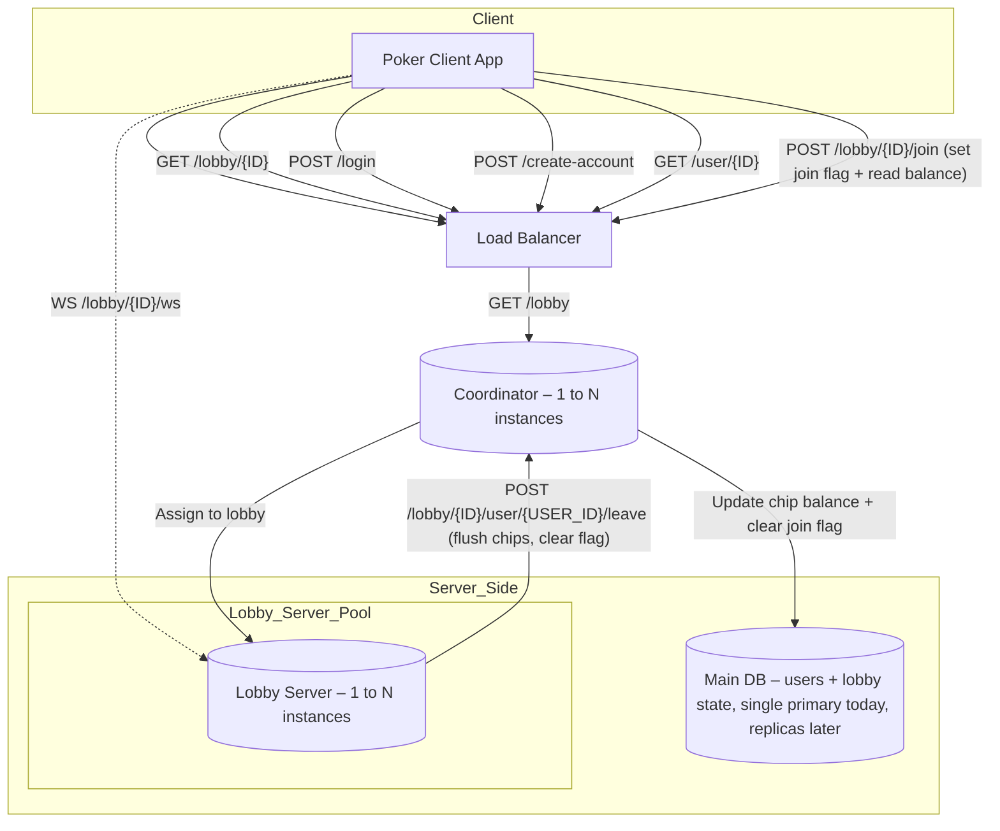

# Online Poker Platform – Scalable Architecture Design

## Overview

This document outlines the system architecture and design decisions for building a scalable online poker platform. While the current implementation is minimal and suited for a single developer, the design anticipates scaling to 100,000 daily users.

## High-Level Goals

* Support 100k daily users (\~5k concurrent)
* Scalable and modular services
* Strong consistency for chip balances and session state
* Designed for AWS deployment with Terraform (future phase)
* Single instance DB and Coordinator now, horizontally scalable later

---

## Core Components

### Poker Client App

* Connects via WebSocket to lobby servers
* Initiates REST calls for login, lobby join, user info

### Load Balancer

* Routes REST requests to one of several Coordinators
* Could be AWS ALB, scalable with autoscaling rules

### Coordinator

* Stateless REST server handling:

  * Lobby listings
  * User login and account creation
  * Join requests: reads chip balance, sets `in_lobby=true`
  * Leave events: updates chip balance and clears `in_lobby` flag
* Talks directly to the Main DB

### Lobby Server

* Manages gameplay and WebSocket communication
* On join: receives chip balance from Coordinator
* During game: maintains chip state in memory
* On player leave/disconnect: calls `POST /lobby/{ID}/user/{USER_ID}/leave` on Coordinator

### Main DB

* Single instance today, future-ready for replication
* Tracks:

  * User profiles
  * Chip balances
  * `in_lobby` flag to prevent simultaneous lobby entries
  * **Lobby metadata**: lobby ID, max players, current players, status

---

## Key Endpoints

### User Management

* `POST /login`
* `POST /create-account`
* `GET /user/{id}`

### Lobby Management

* `GET /lobby` – List all available lobbies
* `GET /lobby/{id}` – Get specific lobby info
* `POST /lobby/{id}/join` – Mark user as in-lobby, return chip balance
* `POST /lobby/{id}/user/{user_id}/leave` – Flush chip balance, clear in-lobby flag

### WebSocket

* `WS /lobby/{id}/ws` – Connects client to lobby server for real-time gameplay

#### Message Types & Payloads

| Message            | Direction       | Fields                                 | Example                                                    |
| ------------------ | --------------- | -------------------------------------- | ---------------------------------------------------------- |
| `join-ack`         | Server → Client | `userId`, `seat`                       | `{ "userId": "abc123", "seat": 2 }`                        |
| `error`            | Server → Client | `error`                                | `{ "error": "Lobby full" }`                                |
| `heartbeat`        | Both            | —                                      | `null`                                                     |
| `player-joined`    | Server → Client | `userId`, `seat`                       | `{ "userId": "abc123", "seat": 5 }`                        |
| `player-left`      | Server → Client | `userId`                               | `{ "userId": "abc123" }`                                   |
| `new-player-card`  | Server → Client | `rank`, `suit`                         | `{ "rank": "A", "suit": "h" }`                             |
| `new-table-card`   | Server → All    | `rank`, `suit`                         | `{ "rank": "9", "suit": "d" }`                             |
| `action`           | Client → Server | `action`, `amount?`                    | `{ "action": "raise", "amount": 200 }`                     |
| `action-broadcast` | Server → All    | `userId`, `action`, `amount?`          | `{ "userId": "abc123", "action": "raise", "amount": 200 }` |
| `round-result`     | Server → All    | `results` (map of userId → chip delta) | `{ "results": { "abc123": -100, "def456": 200 } }`         |

---

## State Consistency Strategy

* On **join**, Coordinator:

  * Reads user chip balance
  * Sets `in_lobby = true`
* On **leave**, Lobby:

  * Calls Coordinator with final chip total
  * Coordinator atomically writes new balance and clears `in_lobby`
* Players are blocked from joining another lobby while `in_lobby=true`
* If a lobby crashes before leave is reported, it’s treated as if the player never joined

---

## Outstanding Considerations

| Area                            | Risk                                         | Mitigation                                             |
| ------------------------------- | -------------------------------------------- | ------------------------------------------------------ |
| Lobby crash mid-session         | Chip balance + `in_lobby` flag never flushed | Acceptable for now; could add heartbeat/watchdog later |
| Replay or double leave requests | Chip double-debit                            | Add `session_id` or make DB write idempotent           |
| Metrics & logs                  | Missing                                      | Add observability for join/leave/chip updates          |

---

## System Architecture Diagram

